<div align="center">


### 🎓 Master's Student in Data & AI at EILCO – ULCO
### 🚀 Data Engineering & Machine Learning Enthusiast

<br>

[](https://www.linkedin.com/in/imad-jaddi-743534244)
[](mailto:imadjaddi2001@gmail.com)
[](https://github.com/YOUR_GITHUB_USERNAME)

</div>

<br>


## 👨‍💻 About Me

Passionate Data & AI graduate student specializing in **Data Engineering** and **Machine Learning**. I focus on building scalable data pipelines, developing intelligent systems, and transforming complex datasets into actionable insights.

- 🔭 Currently working on **ML pipelines and Big Data solutions**
- 🌱 Learning **MLOps and Cloud Architecture**
- 💡 Interested in **AI Research and Innovation**
- 🎯 Goal: **Build impactful data-driven solutions**

<br clear="right"/>

---

## 🛠️ Technical Stack

### 💻 Programming Languages
<p>
  
  
  
  
  
</p>

### 📊 Data Engineering & Big Data
<p>
  
  
  
  
  
</p>

### 🤖 Machine Learning & AI
<p>
  
  
  
  
  
  
</p>

### 🗄️ Databases
<p>
  
  
  
  
  
</p>

### ☁️ Cloud & DevOps
<p>
  
  
  
  
  
  
</p>

### 📈 Data Visualization
<p>
  
  
  
  
</p>

---

## 🎯 Areas of Expertise

<table>
<tr>
<td width="50%">

### 📊 Data Engineering
```yaml
- ETL Pipeline Development
- Big Data Processing (Spark, Hadoop)
- Data Warehousing Solutions
- Stream Processing (Kafka)
- Data Quality & Governance
```

</td>
<td width="50%">

### 🤖 Machine Learning
```yaml
- Deep Learning & Neural Networks
- Natural Language Processing
- Computer Vision
- Predictive Analytics
- Model Optimization
```

</td>
</tr>
<tr>
<td width="50%">

### ⚙️ MLOps
```yaml
- Model Deployment & Serving
- CI/CD for ML Pipelines
- Model Monitoring & Logging
- A/B Testing
- Feature Engineering
```

</td>
<td width="50%">

### 📈 Analytics
```yaml
- Business Intelligence
- Statistical Analysis
- Data Visualization
- Dashboard Development
- Reporting Automation
```

</td>
</tr>
</table>

---

## 📚 Current Learning Journey

```mermaid
graph LR
    A[🎯 Current Focus] --> B[Deep Learning]
    A --> C[MLOps]
    A --> D[Cloud Architecture]
    A --> E[Real-time Processing]
    B --> F[Transformers]
    B --> G[GANs]
    C --> H[Kubernetes]
    C --> I[Model Registry]
    D --> J[AWS]
    D --> K[Azure]
    E --> L[Kafka Streams]
    E --> M[Spark Streaming]
    
    style A fill:#667eea,stroke:#333,stroke-width:2px,color:#fff
    style B fill:#764ba2,stroke:#333,stroke-width:2px,color:#fff
    style C fill:#f093fb,stroke:#333,stroke-width:2px,color:#fff
    style D fill:#4facfe,stroke:#333,stroke-width:2px,color:#fff
    style E fill:#43e97b,stroke:#333,stroke-width:2px,color:#fff
```



---

## 📊 GitHub Statistics

<div align="center">
  


</div>

---

## 💼 Professional Opportunities

<div align="center">

| 🎯 Role | 🔍 Focus Areas |
|---------|----------------|
| **Data Engineer** | ETL Development • Data Pipeline Architecture • Big Data Solutions |
| **ML Engineer** | Model Development • Production ML Systems • MLOps |
| **Data Scientist** | Predictive Analytics • Statistical Modeling • AI Research |
| **AI Engineer** | NLP • Computer Vision • Deep Learning Applications |

</div>

> 💡 **Status:** Actively seeking internship and full-time opportunities in Data Engineering, ML Engineering, and AI Research

---

## 🏆 Achievements & Certifications

```python
achievements = {
    "education": "Master's in Data & AI @ EILCO-ULCO",
    "interests": ["Big Data", "Machine Learning", "MLOps", "Cloud Computing"],
    "current_role": "Graduate Student & Aspiring Data Engineer",
    "motto": "Transforming data into intelligence, one pipeline at a time 🚀"
}
```

---

## 📫 Let's Connect!

<div align="center">

### I'm always excited to discuss innovative projects, opportunities, or collaborations!

<br>

[](https://www.linkedin.com/in/imad-jaddi-743534244)
[](mailto:imadjaddi2001@gmail.com)
[](https://github.com/YOUR_GITHUB_USERNAME)

<br>


<br><br>


</div>
